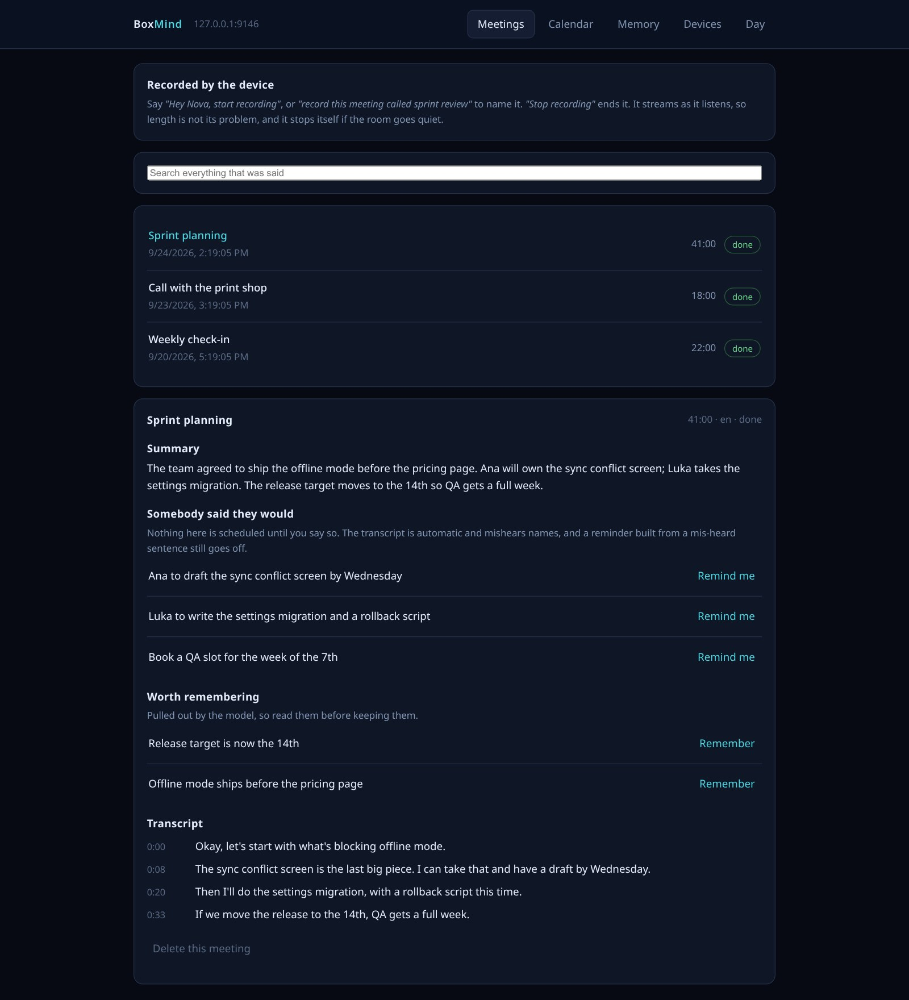
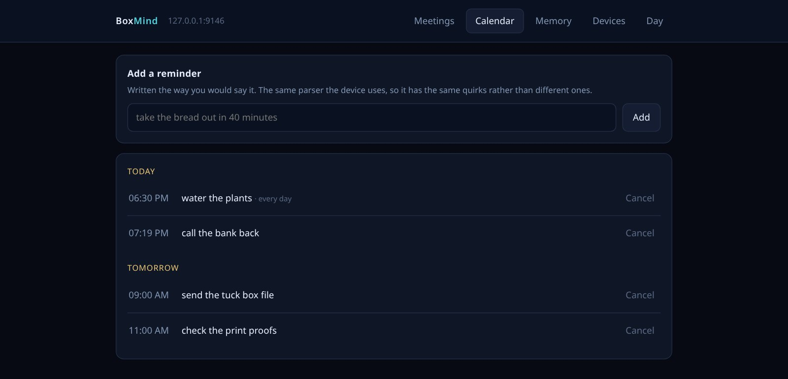
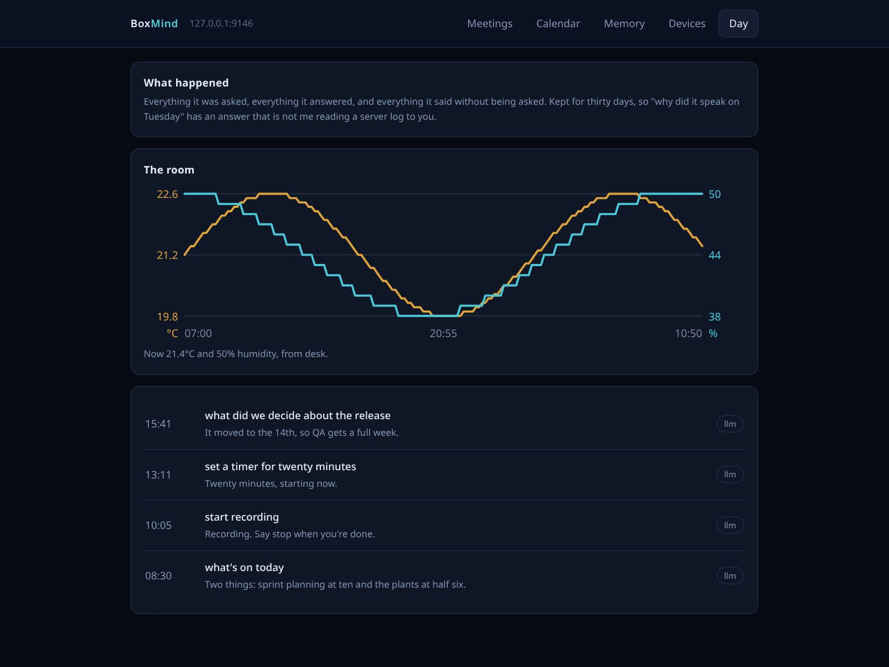

# BoxMinds

**The server side of a pet-shaped voice assistant on an ESP32-S3-BOX-3.** The device on the desk draws a face, listens for its wake word and plays audio. BoxMinds does everything else: transcription, skills, a local language model, text-to-speech, reminders, meeting recordings, and a small web page for what the assistant keeps.

The assistant is tuned for speed on everyday questions. Common requests are answered by skills in well under a second. Questions that have a real answer (service status, the time, a timer) never reach the language model, so it can't make the answer up.



> Screenshots show the web page with invented demo meetings, reminders and room readings; no device or transcription host was connected.

| Calendar | Day log |
|---|---|
|  |  |

## Features

- **Streaming voice turns.** Audio in, transcript, reply, speech out. The reply is synthesised a sentence at a time while the model is still generating, so speech starts early. A barge-in cancels the reply.
- **Skills before the model.** Time, timers, reminders parsed from ordinary speech, volume, voice choice, remembered facts, agenda, time tracking, a morning briefing and an evening wrap-up, "where is which box", and playful activities for the creature. Skills can return a screen along with speech.
- **Service status from a cache.** Self-hosted apps are polled in the background and answered from the cache. Stale data is said to be stale, and an app with no endpoint says so instead of guessing.
- **Web lookups that admit a miss.** Questions go to SearXNG, then Brave (if a key is set), then Wikipedia. The model answers in a sentence, the screen shows which source each line came from, and the model is told to say when the results don't answer the question.
- **A question screen.** Say "I have a question" to dictate a longer question onto the screen, then get a fuller answer with sources.
- **Meetings.** Recording starts by voice on the device or from a browser page. The recording is transcribed on a GPU host and summarised by a larger model into key points, decisions and action items. Long transcripts are summarised in pieces. A custom vocabulary helps with names the transcriber doesn't know. Durable facts from a meeting are offered as candidates and only kept when a person confirms them. You can ask for the exact line where something was said.
- **Memory.** Facts you tell it go into the system prompt, kept separately from the recent conversation history.
- **Speaking first, rarely.** Reminders, alerts and notices can be spoken unprompted, with a deliberately high bar for interrupting.
- **Several boxes.** Devices are identified by MAC and given names. When two boxes hear the wake word, the louder recording wins and only one answers.
- **Guarding against invented words.** Whisper's output on silent audio is detected and dropped instead of being answered.
- **Errands for home.** Instructions for a home-only system are queued while you are away and delivered in order when you return. They expire after a day, and questions are refused rather than queued.
- **Battery estimate.** The dock has no fuel gauge, so charge is estimated from time off the charger, learned from real runs, and presented as an estimate.
- **Over-the-air firmware.** The server offers its published build to any device running something different. Rolling back means publishing the old binary.

## Tech stack

Python · FastAPI · WebSockets · faster-whisper (CUDA) · Piper TTS · llama.cpp · Ollama · SearXNG · Raspberry Pi 5 · systemd · Cloudflare Tunnel · pytest

## How it works

```
ESP32-S3-BOX-3  --binary WebSocket (PCM audio, JSON events)-->  boxmind (Raspberry Pi 5)
                                                                 |  skills, cache, Piper TTS
                                                                 |  local LLM (llama.cpp)
                                                                 v
                                               boxmind-stt (GPU host, faster-whisper)
```

Two services on two machines, placed by measurement. Transcription runs on a GPU host because Whisper's per-call cost dominated a turn on CPU. Everything else runs on an always-on Raspberry Pi. The chat model runs locally on the Pi as well, because a shared inference host gave unpredictable cold-load times.

Device and server share a versioned binary protocol: one type byte and then JSON or 16 kHz PCM. The same contract is compiled into the firmware, and a version mismatch is refused at the handshake. The device authenticates in its first message rather than in the URL, so the key never ends up in access logs. Outside the home network the device connects through Cloudflare Tunnel.

The device firmware is a separate project, [ESP32-Devices](../ESP32-Devices/).

## Design principles

- **Measured, not assumed.** Model sizes, hosts and buffer sizes were chosen from timings taken on the real hardware, and the losing options are written down with their numbers.
- **A question with a real answer never reaches a language model.**
- **A wrong number is worse than no number.** Totals are never summed across currencies, and caveats are spoken when the source data is uncertain.

## Availability

The source code is not public. BoxMinds is a personal project.

## License

Proprietary. © 2026 MUNDA PLUS d.o.o. All rights reserved. See [LICENSE](LICENSE).

## Author

Built by [Marko Munda](https://www.munda.si/) · [Munda Plus](https://github.com/MundaPlus)
